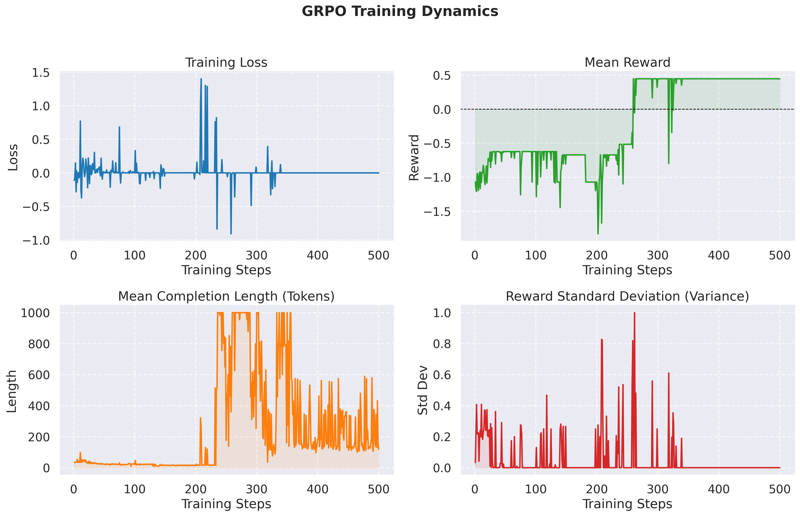
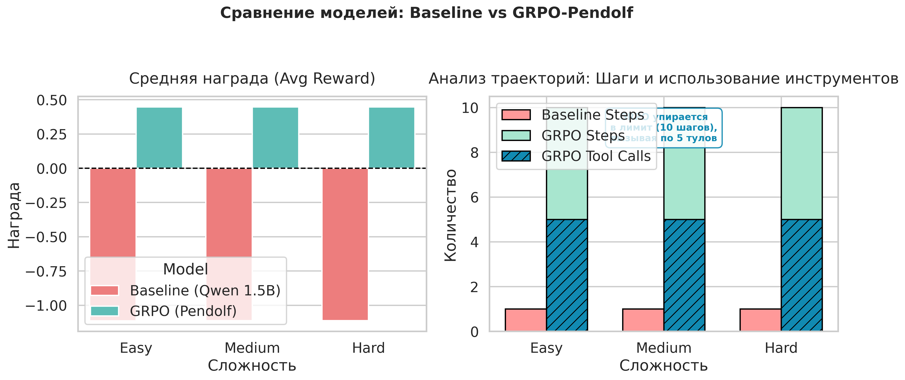

# Оптимизация агентных способностей Qwen 2.5 с помощью GRPO в среде ToolEnv

## 1. Постановка задачи

Цель проекта — обучить компактную языковую модель выступать в роли интерактивного агента (Пендольфа), способного использовать внешние инструменты для решения текстовых квестов.

Агент взаимодействует со средой `PendolfEnv`, получая запросы пользователя и состояние инвентаря. Для успешного прохождения эпизода модель обязана:

1. Выстраивать цепочку рассуждений (Chain-of-Thought).
2. Вызывать инструменты в строгом формате `Action: tool_name('arg')`.
3. Соблюдать логику: проверять статус квеста (`check_quest_status`), проверять наличие предмета (`check_inventory`) и только затем взаимодействовать с ним (`take_item`).

Оценка успешности вычисляется кастомным верификатором (`PendolfVerifier`), который начисляет промежуточные награды за валидные вызовы тулов и штрафует за галлюцинации сущностей, ошибки форматирования и излишнюю болтливость.

## 2. Проводимые эксперименты

Для адаптации базовой LLM под строгие рамки агентной среды был применен метод Group Relative Policy Optimization (GRPO). В качестве базовой модели использовалась `unsloth/Qwen2.5-1.5B-Instruct`

Оценка проводилась на трех отложенных датасетах разного уровня сложности (`eval_easy`, `eval_medium`, `eval_hard`). На высоких уровнях сложности среда генерирует условия, требующие от агента многошагового планирования (вызов от 3 до 4 инструментов подряд).

| Шаг | Название эксперимента | Описание процесса |
| --- | --- | --- |
| **Шаг 1** | Baseline оценка | Замеряем `success_rate` и длину траектории (шаги/тулы) на базовой модели без дообучения. Модель получает только системный промпт с правилами. |
| **Шаг 2** | Обучение GRPO | Обучаем модель с использованием алгоритма GRPO. В качестве функции вознаграждения выступает `PendolfVerifier`, возвращающий скалярный `total_reward` на основе исхода эпизода и штрафов (shaping). |
| **Шаг 3** | Поведенческий анализ | Оценка обученного чекпоинта на валидационной выборке для сравнения способностей к использованию инструментов по сравнению с бейзлайном. |

## 3. Результаты

Эксперимент продемонстрировал, что алгоритм GRPO успешно обучает модель синтаксису среды и использованию инструментов, однако жесткие рамки верификатора могут привести к зацикливанию агента (Tool-calling loop), если он не находит паттерн финального ответа.

**Сводная таблица результатов (Baseline vs GRPO):**

| Метрика | Baseline (Easy) | Baseline (Hard) | GRPO (Easy) | GRPO (Hard) |
| --- | --- | --- | --- | --- |
| **Success Rate** (Доля успешно решенных квестов) | 0.0% | 0.0% | 0.0% | 0.0% |
| **Avg Reward** (Средняя итоговая награда) | -1.11 | -1.11 | **+0.45** | **+0.45** |
| **Avg Steps** (Длина траектории до завершения) | 1.0 | 1.0 | **10.0** | **10.0** |
| **Avg Tool Calls** (Количество вызванных инструментов) | 0.0 | 0.0 | **5.0** | **5.0** |

### Ключевые выводы:

* **Полный отказ Baseline:** Необученная базовая модель Qwen 2.5 оказалась неспособна действовать в рамках среды. Модель игнорировала синтаксис `Action:`, предпочитая отвечать в формате обычного диалогового ассистента. Это приводило к мгновенному прерыванию эпизодов на первом же шаге (Avg Steps = 1.0) и стабильным отрицательным наградам (-1.11).
* **Усвоение синтаксиса через RL:** Алгоритм GRPO успешно преодолел "диалоговую" природу модели. Обученный агент научился безошибочно генерировать валидные конструкции вызова тулов (Avg Policy Violations = 0.0, Avg Invalid Actions = 0.0). Это позволило вывести среднюю награду в устойчивую положительную зону (+0.45 за счет микро-наград среды).
* **Зацикливание агента (Tool-calling loop):** Анализ траекторий выявил классическую проблему RL — зацикливание (Looping). Агент усвоил, что вызов инструментов (`check_inventory`, `take_item`) приносит промежуточные очки, но не смог выучить триггер для успешного завершения эпизода (генерацию победной реплики и флага `done=True`).
* **Итог:** В попытках максимизировать награду модель начала циклично вызывать по 5 инструментов за эпизод, пока не упиралась в жесткий лимит верификатора (Max Steps = 10). В результате эпизод принудительно прерывался со статусом `success_rate = 0.0`. Для решения этой проблемы требуется внедрение более строгого штрафа за длину траектории (Step Penalty) или добавление few-shot примеров успешного завершения квеста в системный промпт.

## 4. Визуализации

## 5 Система штрафов при обучении агента

| Категория | Триггер / Действие | Значение | Примечание |
| --- | --- | --- | --- |
| **Финальный исход (Outcome)** | Успешное прохождение | **+1.0** | Выдана финальная фраза ("монеты"/"лжец"), `done=True`, награда среды > 0 |
|  | Провал / Зацикливание | **-1.0** | Лимит шагов превышен ИЛИ финальное действие неверное |
| **Инструменты (Среда)** | `take_item('...')` | **+0.5** | Валидный вызов инструмента взятия предмета |
|  | `check_inventory` / `check_quest_status` | **+0.1** | Валидный вызов инструмента проверки |
|  | Неизвестный инструмент | **-0.5** | Формат верный, но такого тула нет в среде |
|  | Ошибка синтаксиса тула | **-0.1** | Не пройдена проверка регулярным выражением |
| **Поощрения (Крошки)** | Использование слова `Мысль:` | **+0.05** | Защита от фарма: только на 1-м и 2-м шагах (`steps < 3`) |
|  | Наличие слова `Action:` | **+0.05** | Защита от фарма: только на 1-м и 2-м шагах (`steps < 3`) |
| **Штрафы за поведение (Shaping)** | Нарушение правил (Policy Violation) | **-0.5** | Галлюцинация сущности ИЛИ взятие предмета без проверки |
|  | Невалидный синтаксис (Invalid Action) | **-0.3** | Суммируется за каждую кривую попытку вызова инструмента |
|  | Зацикливание (Loops) | **-0.3** | Действие полностью совпадает с предыдущим шагом |
|  | Штраф за длину сессии (Steps) | **-0.1** | За каждый совершенный шаг (стимулирует решать квест быстрее) |
|  | Налог на инструменты (Tool Calls) | **-0.02** | За каждый вызов инструмента |
|  | Штраф за многословие | **-0.0001 × N** | За каждый символ в тексте (без Action). N — длина строки |

